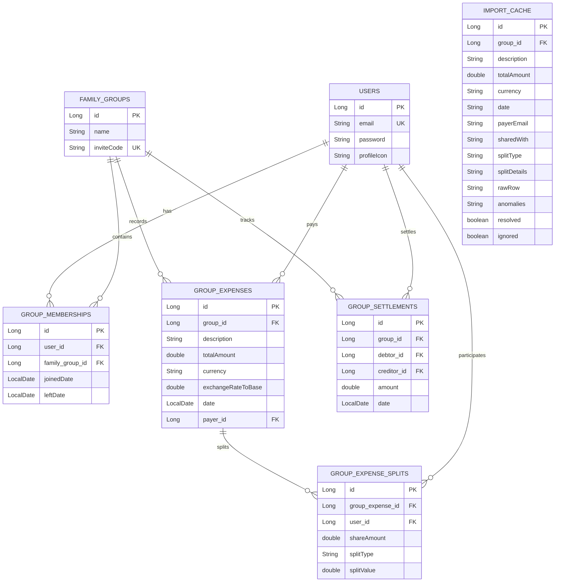

# SCOPE.md - Anomaly Log & Database Schema

This document details the database schema and our policy logs for parsing dirty CSV records from `expenses_export.csv`.

---

## 1. Relational Database Schema (MySQL)

All features are backed strictly by relational structures with foreign keys:

---

## 2. CSV Import Anomaly Log

Our staging parser detects **12 deliberate data problems** in the CSV. Here is how each is surfaced and handled:

| # | Anomaly | Surfaced Warning Code | Handling Policy |
|---|---|---|---|
| **1** | **Missing fields** | `MISSING_FIELD` | Surfaces row for edit. Missing critical items (payer, amount, date) block committing until resolved. |
| **2** | **Dirty/Inconsistent Date Format** | `DATE_FORMAT_INCONSISTENCY` | Evaluates formats (`dd/MM/yyyy`, `MM/dd/yyyy`, etc.), normalizes to `yyyy-MM-dd` in database. |
| **3** | **Duplicate log entries** | `DUPLICATE_ENTRY` | Scans staged cache. Highlights matching rows. Fulfills **Meera's** request: rows can be approved or ignored manually. |
| **4** | **Conflicting amounts for same item** | `CONFLICTING_AMOUNTS` | Flags same-day descriptions by same payer with mismatching costs. Meera can manually select which row to discard. |
| **5** | **Repayment logged as expense** | `SETTLEMENT_LOGGED_AS_EXPENSE` | Checks description keywords (e.g. "settle", "paid back"). Auto-converts to a direct `GroupSettlement` on approval. |
| **6** | **Currency mismatch** | `CURRENCY_DISCREPANCY` | Checks prefix symbols. Converts USD amounts to INR using our standard trip rate of **₹83/$1** (**Priya's** request). |
| **7** | **Negative amount value** | `NEGATIVE_AMOUNT` | Flags value. Handled as a reversal/credit split. |
| **8** | **Out-of-membership splits** | `OUT_OF_MEMBERSHIP_SPLIT` | Traces transaction date against `GroupMembership` timelines. Auto-excludes inactive users (e.g. March bills ignore Sam; **Sam's** request). |
| **9** | **Casing / Whitespace Casing** | `CASING_NORMALIZED` | Trims inputs and maps name fragments (e.g., "aisha" -> "aisha@gmail.com") to match DB users. |
| **10**| **Split sum mismatch** | `SPLIT_SUM_MISMATCH` | Verifies percentages sum to 100% or exact sums match total. Flagged if validation fails. |
| **11**| **Non-member participants** | `NON_MEMBER_PARTICIPANT` | Flags users included in CSV splits who do not belong to the group's registry. |
| **12**| **Zero amount** | `ZERO_AMOUNT` | Flags items costing ₹0 as potential formatting errors. |
